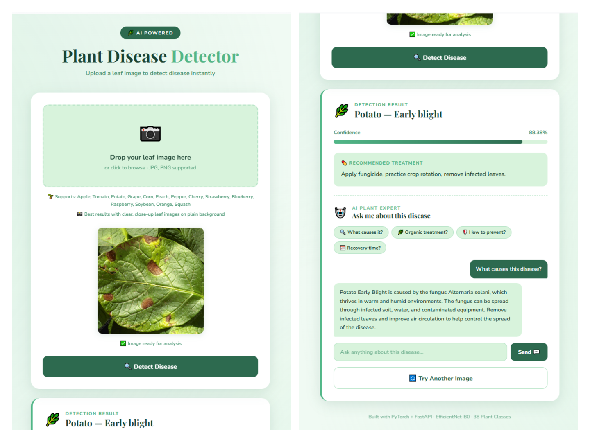
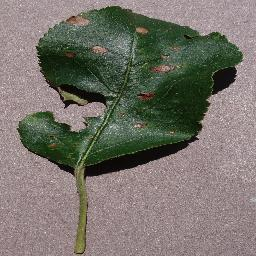
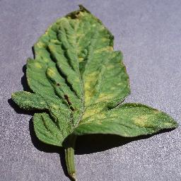
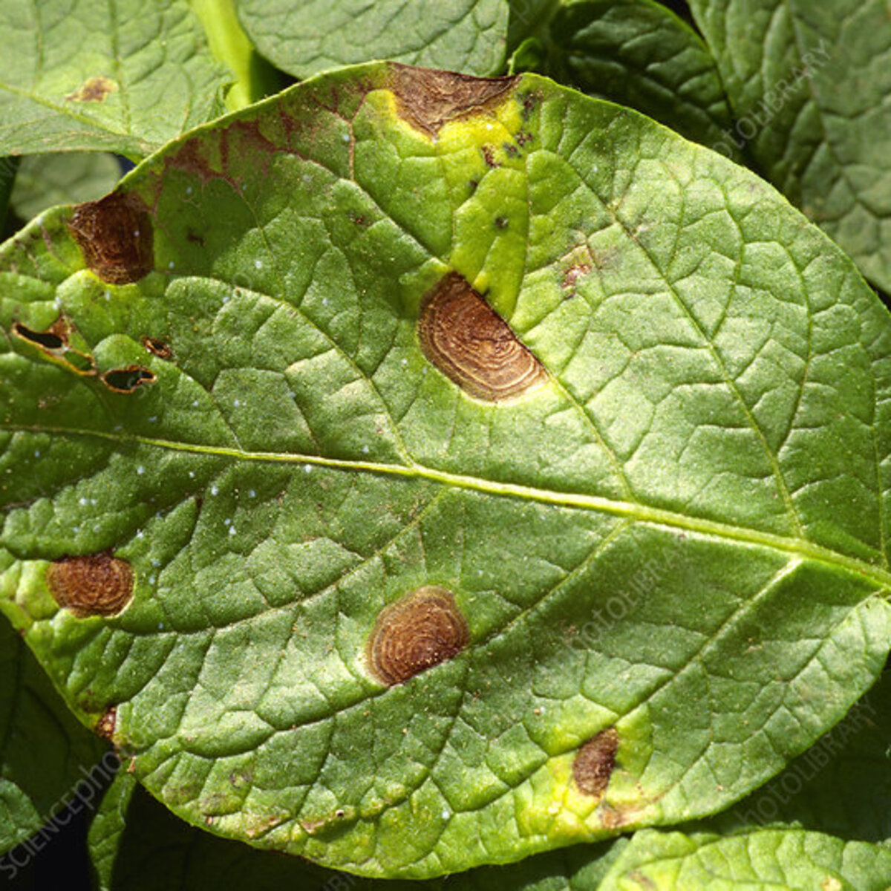
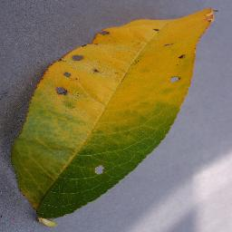
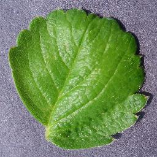

# 🌿 Plant Disease Detector

🚀 **Live Demo:** [huggingface.co/spaces/Vaishu-1404/plant-disease-detector](https://huggingface.co/spaces/Vaishu-1404/plant-disease-detector)

An end-to-end deep learning web application that detects plant diseases from leaf images using **EfficientNet-B0** and **Transfer Learning**, served via a **FastAPI** backend with an **LLM-powered chatbot** for intelligent treatment guidance.

---

## 🎯 Project Overview

Farmers and gardeners often struggle to identify plant diseases early. This app allows users to upload a leaf image and instantly receive:

- **Disease name** (38 classes supported)
- **Confidence score**
- **Treatment recommendation**
- **AI-powered chatbot** to ask follow-up questions about the disease

---

## 🖼️ Demo

> Upload a leaf image → Get disease detection + treatment + ask the AI expert!

<table>
<tr>
<td align="center">
<b>Upload Leaf Image</b><br>

</td>
<td align="center">
<b>Prediction Result</b><br>

</td>
</tr>
</table>

---

## 🌿 Try with Sample Leaf Images

You can test the live demo using these example leaf images.

<table>
<tr>
<td align="center">
<b>Apple Leaf</b><br>

</td>
<td align="center">
<b>Tomato Leaf</b><br>

</td>
<td align="center">
<b>Potato Leaf</b><br>

</td>
<td align="center">
<b>Peach Leaf</b><br>

</td>
<td align="center">
<b>Healthy Leaf</b><br>

</td>
</tr>
</table>

Download or screenshot these images and upload them in the live demo.

---

## ✨ Features

- **Disease Detection** — Identifies 38 plant diseases across 14 crops
- **OOD Detection** — Rejects non-plant images using entropy + confidence thresholding
- **AI Chatbot** — LLM-powered expert (Groq + LLaMA 3.3) answers treatment questions
- **Treatment Guidance** — Instant recommendations for every detected disease
- **Mobile Responsive** — Works on all devices

---

## 🏗️ Tech Stack

| Layer | Technology |
|---|---|
| Model | PyTorch, EfficientNet-B0, Transfer Learning |
| Dataset | PlantVillage (54,305 images, 38 classes) |
| Backend | FastAPI, Uvicorn |
| LLM | LLaMA 3.3 via Groq API |
| Frontend | HTML5, CSS3, JavaScript |
| Training | Google Colab + Kaggle (T4 GPU) |
| Deployment | Docker + HuggingFace Spaces |

---

## 📊 Model Performance

| Metric | V1 | V2 |
|---|---|---|
| Validation Accuracy | 98.79% | **99.82%** |
| OOD Detection | ❌ | ✅ |
| Real-world Augmentation | ❌ | ✅ |
| Class Weights (Imbalance Fix) | ❌ | ✅ |
| LLM Chatbot | ❌ | ✅ |

---

## 🏗️ Architecture

```
Image Upload
    ↓
OOD Check (Entropy + Confidence Threshold)
    ↓
EfficientNet-B0 → Disease Classification
    ↓
Treatment Lookup + LLM Chatbot (Groq API)
```

---

## 🌱 Supported Plants

Apple, Tomato, Potato, Grape, Corn, Peach, Pepper, Cherry, Strawberry, Blueberry, Raspberry, Soybean, Orange, Squash

> ⚠️ Best results with clear, close-up leaf images on a plain background.

---

## 🚀 Run Locally

### 1. Clone the repo
```bash
git clone https://github.com/vaishu-1404/plant-disease-detector.git
cd plant-disease-detector
```

### 2. Install dependencies
```bash
pip install -r requirements.txt
```

### 3. Add model file
Download `plant_disease_model_v2.pth` and place it in the `model/` folder.

### 4. Set environment variable
```bash
export GROQ_API_KEY=your_groq_api_key
```

### 5. Start FastAPI server
```bash
uvicorn api.main:app --reload
```

### 6. Open UI
Open `ui/index.html` in your browser.

---

## 📁 Project Structure

```
plant-disease-detector/
│
├── api/
│   └── main.py              # FastAPI app + /predict + /chat endpoints
├── model/
│   ├── plant_disease_model_v2.pth
│   └── class_names.json     # 38 class labels
├── ui/
│   └── index.html           # Frontend UI
├── demo-images/             # Sample leaf images for testing
├── requirements.txt
└── README.md
```

---

## 🔮 Roadmap

- [x] EDA on PlantVillage dataset
- [x] Transfer Learning with EfficientNet-B0 (98.79% accuracy)
- [x] FastAPI REST API with confidence scoring
- [x] Treatment recommendations
- [x] Mobile-responsive UI
- [x] OOD Detection — rejects non-plant images
- [x] V2 Fine-tuning with Albumentations augmentation (99.82% accuracy)
- [x] LLM-powered chatbot (Groq + LLaMA 3.3)
- [x] Deployed on HuggingFace Spaces with Docker
- [ ] Non-plant class training for better OOD
- [ ] Support for more plant species

---

## 👩‍💻 Author

**Vaishnavi Talari** — Jr. Backend Developer transitioning to ML/AI

[](https://linkedin.com/in/vaishnavitalari)
[](https://github.com/vaishu-1404)
