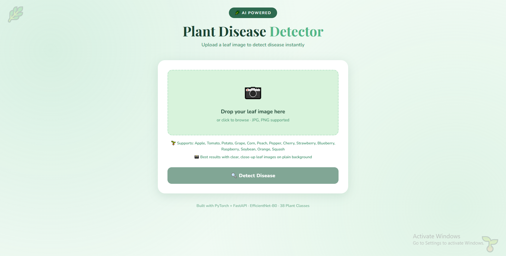
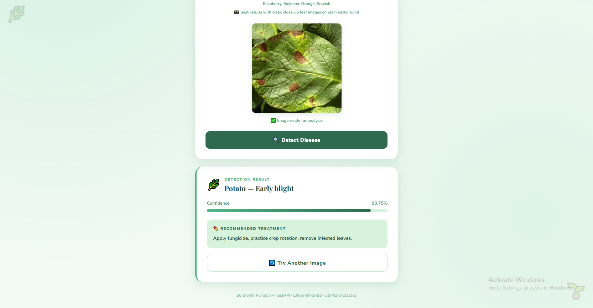

# 🌿 Plant Disease Detector

🚀 Live Demo:
https://huggingface.co/spaces/Vaishu-1404/plant-disease-detector

An end-to-end deep learning web application that detects plant diseases from leaf images using **EfficientNet-B0** and **Transfer Learning**, served via a **FastAPI** backend with a clean, mobile-responsive UI.


---

## 🎯 Project Overview

Farmers and gardeners often struggle to identify plant diseases early. This app allows users to upload a leaf image and instantly receive:
- **Disease name** (38 classes supported)
- **Confidence score**
- **Treatment recommendation**

---

## 🖼️ Demo

> Upload a leaf image → Get disease detection + treatment in seconds!




---

## 🏗️ Tech Stack

| Layer | Technology |
|---|---|
| Model | PyTorch, EfficientNet-B0, Transfer Learning |
| Dataset | PlantVillage (54,305 images, 38 classes) |
| Backend | FastAPI, Uvicorn |
| Frontend | HTML5, CSS3, JavaScript |
| Training | Google Colab (T4 GPU) |

---

## 📊 Model Performance

| Metric | Value |
|---|---|
| Architecture | EfficientNet-B0 (Pretrained) |
| Training Epochs | 10 |
| Validation Accuracy | **98.79%** |
| Dataset Split | 80% Train / 20% Validation |
| Image Size | 224 × 224 |

---

## 🌱 Supported Plants

Apple, Tomato, Potato, Grape, Corn, Peach, Pepper, Cherry, Strawberry, Blueberry, Raspberry, Soybean, Orange, Squash

> ⚠️ Best results with clear, close-up leaf images on a plain background.

---

## 🚀 Run Locally

### 1. Clone the repo
```bash
git clone https://github.com/vaishu-1404/plant-disease-detector.git
cd plant-disease-detector
```

### 2. Install dependencies
```bash
pip install -r requirements.txt
```

### 3. Add model file
Download `plant_disease_model.pth` and place it in the `model/` folder.

### 4. Start FastAPI server
```bash
uvicorn api.main:app --reload
```

### 5. Open UI
Open `ui/index.html` in your browser.

---

## 📁 Project Structure

```
plant-disease-detector/
│
├── api/
│   └── main.py              # FastAPI app + /predict endpoint
├── model/
│   └── class_names.json     # 38 class labels
├── ui/
│   └── index.html           # Frontend UI
├── requirements.txt
└── README.md
```

---

## 🔮 Roadmap

- [x] EDA on PlantVillage dataset
- [x] Transfer Learning with EfficientNet-B0
- [x] FastAPI REST API with confidence scoring
- [x] Treatment recommendations
- [x] Mobile-responsive UI
- [ ] LLM-based chatbot for interactive treatment guidance
- [ ] Deploy on Hugging Face Spaces
- [ ] Expand to more plant species

---

## 👩‍💻 Author

**Vaishnavi Talari** — Jr. Backend Developer transitioning to ML/AI

[](https://linkedin.com/in/vaishnavitalari)
[](https://github.com/vaishu-1404)
